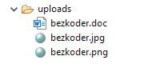
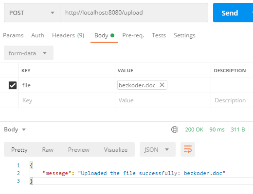
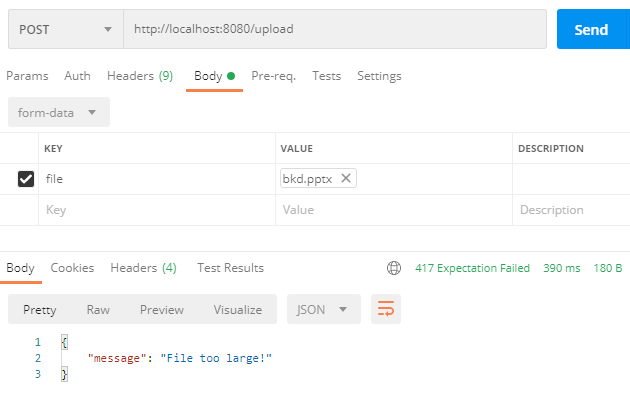
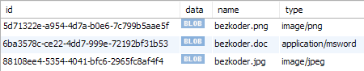
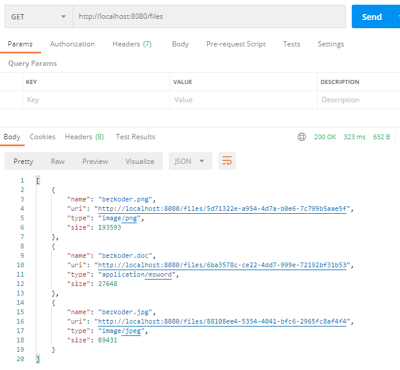

# Spring Boot Upload/Download File to/from Database example

In this tutorial, I will show you how to upload and download files with a Spring Boot Rest APIs
to/from a static folder. We also use Spring Web MultipartFile interface to handle
HTTP [multi-part](https://www.w3.org/Protocols/rfc1341/7_2_Multipart.html)
requests.

## Spring Boot Rest APIs for uploading Files to Database

Our Spring Boot Application will provide APIs for:

- uploading File to a static folder in the Server
- downloading File from server with the link
- getting list of Files’ information (file name & url)

Methods    |Urls    |Actions
----|----|----
POST    | /upload    |upload a File
GET    | /files    |get List of Files (name & url)
GET    | /files/[fileId]    |download a File

The uploaded files will be stored in PostgreSQL/MySQL Database **files** table with these fields:
`id, name, type` and `data` as **BLOB** type (Binary Large Object is for storing binary data like
file, image, audio, or video).



## Technology

- Java 8
- Spring Boot 2 (with Spring Web MVC)
- PostgreSQL/MySQL Database
- Maven 3.6.1

## Setup Spring Boot project

```xml

<dependency>
  <groupId>org.springframework.boot</groupId>
  <artifactId>spring-boot-starter-web</artifactId>
</dependency>

<dependency>
<groupId>org.springframework.boot</groupId>
<artifactId>spring-boot-starter-data-jpa</artifactId>
</dependency>
```

We also need to add one more dependency. – If you want to use MySQL:

```xml

<dependency>
  <groupId>mysql</groupId>
  <artifactId>mysql-connector-java</artifactId>
  <scope>runtime</scope>
</dependency>
```

– or PostgreSQL:

```xml

<dependency>
  <groupId>org.postgresql</groupId>
  <artifactId>postgresql</artifactId>
  <scope>runtime</scope>
</dependency>
```

## Create Data Model

- _model/FileDB.java_

`data` is annotated by **@Lob** annotation. **LOB** is datatype for storing large object data.
There’re two kinds of LOB: BLOB and CLOB:

- BLOB is for storing binary data
- CLOB is for storing text data

## Create Repository

- _repository/FileDBRepository.java_

## Create Service for File Storage

- _service/FileStorageService.java_

## Define Response Information Classes

- _message/ResponseFile.java_
- _message/ResponseMessage.java_

## Create Controller for upload & download Files to Database

- _controller/FileController.java_

## Configure Spring Datasource, JPA, Hibernate

- _application.properties_

### For MySQL:

```
spring.datasource.url= jdbc:mysql://localhost:3306/testdb?useSSL=false
spring.datasource.username= root
spring.datasource.password= 123456

spring.jpa.properties.hibernate.dialect= org.hibernate.dialect.MySQL5InnoDBDialect

# Hibernate ddl auto (create, create-drop, validate, update)
spring.jpa.hibernate.ddl-auto= update
```

### For PostgreSQL:

```
spring.datasource.url= jdbc:postgresql://localhost:5432/testdb
spring.datasource.username= postgres
spring.datasource.password= 123

spring.jpa.properties.hibernate.jdbc.lob.non_contextual_creation= true
spring.jpa.properties.hibernate.dialect= org.hibernate.dialect.PostgreSQLDialect

# Hibernate ddl auto (create, create-drop, validate, update)
spring.jpa.hibernate.ddl-auto= update
```

## Configure Multipart File for Servlet

- _application.properties_

```
spring.servlet.multipart.max-file-size=2MB
spring.servlet.multipart.max-request-size=2MB
```

## Handle File Upload Exception

- _exception/FileUploadExceptionAdvice.java_

## Run & Test

Run Spring Boot application with command: `mvn spring-boot:run`. Let’s use Postman to make some
requests.

– Upload some files:



– Upload a file with size larger than max file size (2MB):



– Check files table in Database:



– Retrieve list of Files’ information:



– Now you can download any file from one of the paths above. For
example: http://localhost:8080/files/6ba3578c-ce22-4dd7-999e-72192bf31b53