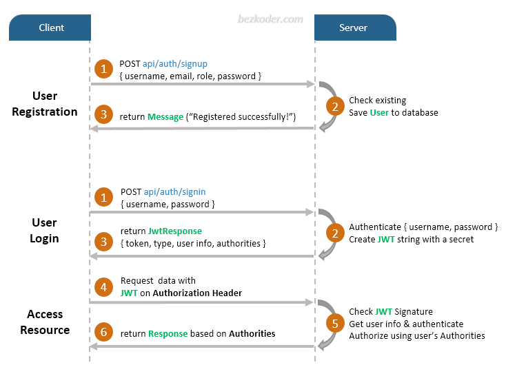
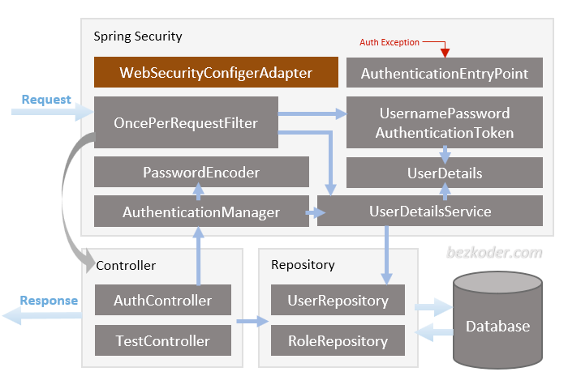
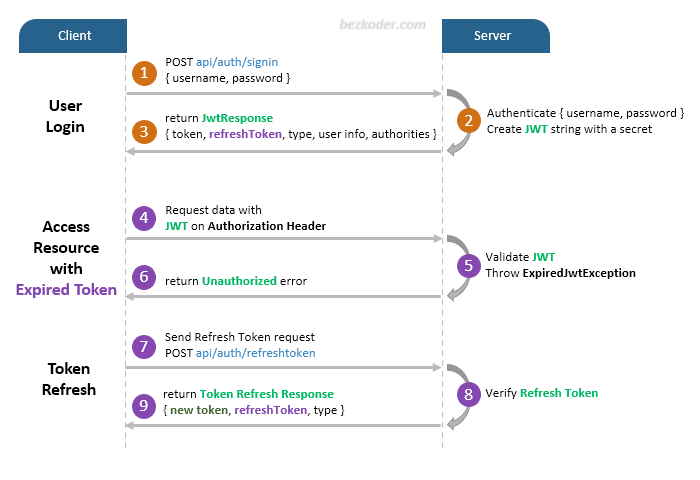

# [Spring Boot JWT Authentication example with Spring Security & Spring Data JPA](https://www.bezkoder.com/spring-boot-jwt-authentication)

> [Source Code](https://github.com/bezkoder/spring-boot-spring-security-jwt-authentication)
 
## Overview
### User Registration, User Login and Authorization process.
The diagram shows flow of how we implement User Registration, User Login and Authorization process.

### Spring Boot Server Architecture with Spring Security

You can have an overview of our Spring Boot Server with the diagram below:

### Refresh Token

