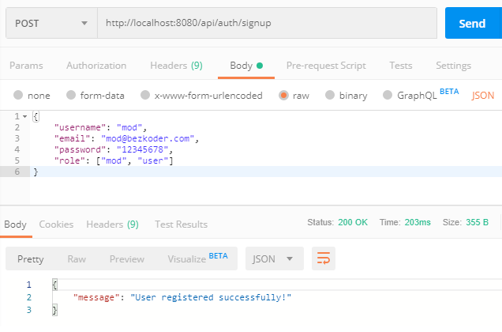
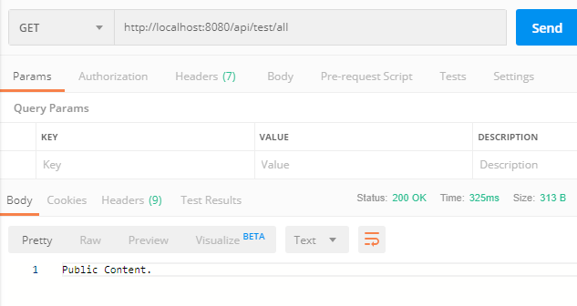
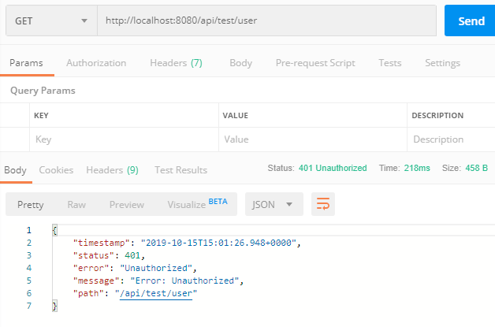
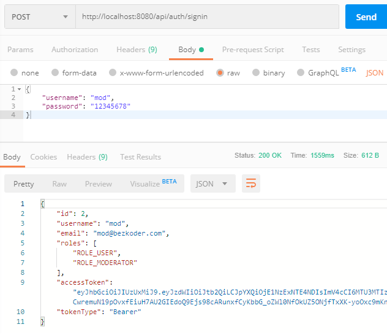
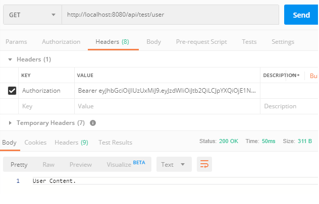
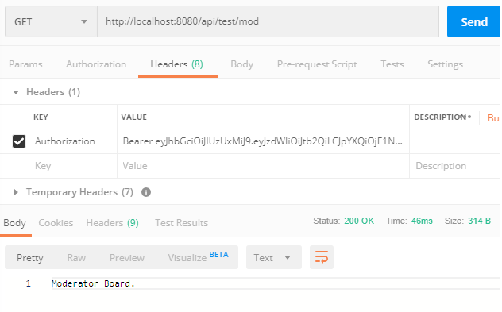
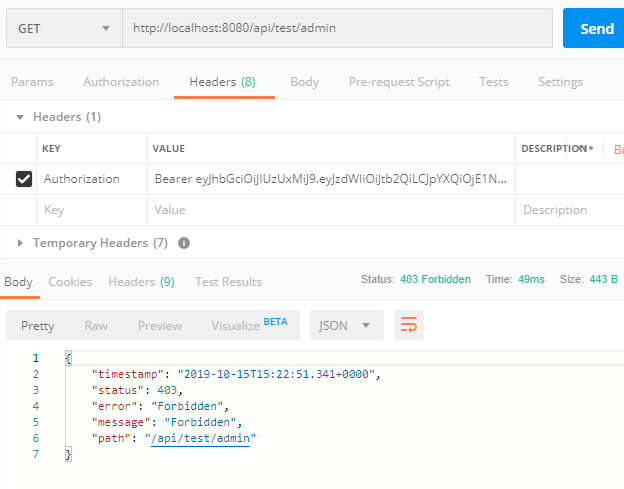

- [Spring Boot JWT Authentication example with Spring Security & Spring Data JPA](#spring-boot-jwt-authentication-example-with-spring-security--spring-data-jpa)
- [Materials](#materials)
  - [Overview](#overview)
    - [User Registration, User Login and Authorization process.](#user-registration-user-login-and-authorization-process)
    - [Spring Boot Server Architecture with Spring Security](#spring-boot-server-architecture-with-spring-security)
    - [Refresh Token](#refresh-token)
  - [Technology](#technology)
  - [Setup new Spring Boot project](#setup-new-spring-boot-project)
  - [Configure Spring Datasource, JPA, App properties](#configure-spring-datasource-jpa-app-properties)
  - [Create the models@](#create-the-models)
  - [Implement Repositories](#implement-repositories)
  - [Configure Spring Security](#configure-spring-security)
    - [Implement UserDetails & UserDetailsService](#implement-userdetails--userdetailsservice)
    - [Filter the Requests](#filter-the-requests)
    - [Create JWT Utility class](#create-jwt-utility-class)
    - [Handle Authentication Exception](#handle-authentication-exception)
  - [Define payloads for Spring RestController](#define-payloads-for-spring-restcontroller)
    - [Create Spring RestAPIs Controllers](#create-spring-restapis-controllers)
    - [Controller for testing Authorization](#controller-for-testing-authorization)
  - [Run & Test](#run--test)
    - [Create Database and User on MySQL](#create-database-and-user-on-mysql)

# [Spring Boot JWT Authentication example with Spring Security & Spring Data JPA](https://www.bezkoder.com/spring-boot-jwt-authentication)

> [Source Code](https://github.com/bezkoder/spring-boot-spring-security-jwt-authentication)

# Materials

- [Spring Security: In-Memory Invalidation of JWT Tokens During User Logout](https://stackabuse.com/spring-security-in-memory-invalidation-of-jwt-token-during-user-logout)

## Overview

### User Registration, User Login and Authorization process.

The diagram shows flow of how we implement User Registration, User Login and Authorization process.


### Spring Boot Server Architecture with Spring Security

You can have an overview of our Spring Boot Server with the diagram below:


### Refresh Token


## Technology

- Java 8
- Spring Boot 2.5.3 (with Spring Security, Spring Web, Spring Data JPA)
- jjwt 0.9.1
- PostgreSQL/MySQL
- Maven 3.6.1

## Setup new Spring Boot project

_pom.xml_

We also need to add one more dependency. – If you want to use PostgreSQL:

```xml

<dependency>
  <groupId>org.postgresql</groupId>
  <artifactId>postgresql</artifactId>
  <scope>runtime</scope>
</dependency>
```

– or MySQL is your choice:

```xml

<dependency>
  <groupId>mysql</groupId>
  <artifactId>mysql-connector-java</artifactId>
  <scope>runtime</scope>
</dependency>
```

## Configure Spring Datasource, JPA, App properties

- For Postgresql

```
spring.datasource.url= jdbc:postgresql://localhost:5432/testdb
spring.datasource.username= postgres
spring.datasource.password= 123

spring.jpa.properties.hibernate.jdbc.lob.non_contextual_creation= true
spring.jpa.properties.hibernate.dialect= org.hibernate.dialect.PostgreSQLDialect

# Hibernate ddl auto (create, create-drop, validate, update)
spring.jpa.hibernate.ddl-auto= update

# App Properties
bezkoder.app.jwtSecret= keerSecretKey
bezkoder.app.jwtExpirationMs= 86400000
```

- For MySQL

```
spring.datasource.driver-class-name=com.mysql.cj.jdbc.Driver
spring.datasource.url=jdbc:mysql://localhost:33060/springboot_jwt?useUnicode=true&characterEncoding=utf8&useSSL=false
spring.datasource.username=springboot
spring.datasource.password=123456
spring.jpa.properties.hibernate.dialect=org.hibernate.dialect.MySQL5InnoDBDialect
spring.jpa.hibernate.ddl-auto=update
spring.jpa.show-sql=true
# App Properties
bezkoder.app.jwtSecret=keerSecretKey
bezkoder.app.jwtExpirationMs=86400000
```

## Create the models@

- _models/ERole.java_
- _models/Role.java_
- _models/User.java_

## Implement Repositories

- _repository/UserRepository.java_
- _repository/RoleRepository.java_

## Configure Spring Security

_security/WebSecurityConfig.java_

– `@EnableWebSecurity` allows Spring to find and automatically apply the class to the global Web
Security.

– `@EnableGlobalMethodSecurity` provides AOP security on methods. It enables `@PreAuthorize`
, `@PostAuthorize`, it also supports [JSR-250](https://en.wikipedia.org/wiki/JSR_250). You can find
more parameters in configuration in
[Method Security Expressions](https://docs.spring.io/spring-security/site/docs/current/reference/htmlsingle/#method-security-expressions)
.

- We override the `configure(HttpSecurity http)` method from `WebSecurityConfigurerAdapter`
  interface. It tells Spring Security how we configure CORS and CSRF, when we want to require all
  users to be authenticated or not, which filter (`AuthTokenFilter`) and when we want it to work (
  filter before
  `UsernamePasswordAuthenticationFilter`), which Exception Handler is chosen (`AuthEntryPointJwt`).

– Spring Security will load User details to perform authentication & authorization. So it has
`UserDetailsService` interface that we need to implement.

– The implementation of UserDetailsService will be used for configuring `DaoAuthenticationProvider`
by
`AuthenticationManagerBuilder.userDetailsService()` method.

– We also need a PasswordEncoder for the `DaoAuthenticationProvider`. If we don’t specify, it will
use plain text.

### Implement UserDetails & UserDetailsService

- _security/services/UserDetailsImpl.java_
- _security/services/UserDetailsServiceImpl.java_

### Filter the Requests

- _security/jwt/AuthTokenFilter.java_

### Create JWT Utility class

- _security/jwt/JwtUtils.java_

### Handle Authentication Exception

- _security/jwt/AuthEntryPointJwt.java_

## Define payloads for Spring RestController

Let me summarize the payloads for our RestAPIs:

**Requests:**

- LoginRequest: { username, password }
- SignupRequest: { username, email, password }

**Responses:**

- JwtResponse: { token, type, id, username, email, roles }
- MessageResponse: { message }

### Create Spring RestAPIs Controllers

- _controllers/AuthController.java_

### Controller for testing Authorization

- _controllers/TestController.java_

## Run & Test

### Create Database and User on MySQL

```mysql-sql
create database springboot_jwt default charset utf8 collate utf8_general_ci;
create user 'springboot'@'%' identified by '123456';
grant all privileges on springboot_jwt.* to "springboot";
flush privileges;
```

Tables that we define in models package will be automatically generated in Database.

We also need to add some rows into roles table before assigning any role to User. Run following SQL
insert statements:

```mysql-sql
INSERT INTO roles(name) VALUES('ROLE_USER');
INSERT INTO roles(name) VALUES('ROLE_MODERATOR');
INSERT INTO roles(name) VALUES('ROLE_ADMIN');
```

Register some users with /signup API:

- **admin** with ROLE_ADMIN
- **mod** with ROLE_MODERATOR and ROLE_USER
- **zkoder** with ROLE_USER



Our tables after signup could look like this.

```
mysql> select * from users;
+----+--------------------+--------------------------------------------------------------+----------+
| id | email              | password                                                     | username |
+----+--------------------+--------------------------------------------------------------+----------+
|  1 | admin@bezkoder.com | $2a$10$mR4MU5esBbUd6JWuwWKTA.tRy.jo4d4XRkgnamcOJfw5pJ8Ao/RDS | admin    |
|  2 | mod@bezkoder.com   | $2a$10$VcdzH8Q.o4KEo6df.XesdOmXdXQwT5ugNQvu1Pl0390rmfOeA1bhS | mod      |
|  3 | user@bezkoder.com  | $2a$10$c/cAdrKfiLLCDcnXvdI6MumFMthIxVCDcWjp2XcRqkRfdzba5P5.. | user     |
+----+--------------------+--------------------------------------------------------------+----------+
3 rows in set (0.00 sec)


mysql> select * from roles;
+----+----------------+
| id | name           |
+----+----------------+
|  1 | ROLE_USER      |
|  2 | ROLE_MODERATOR |
|  3 | ROLE_ADMIN     |
+----+----------------+
3 rows in set (0.00 sec)


mysql> select * from user_roles;
+---------+---------+
| user_id | role_id |
+---------+---------+
|       2 |       1 |
|       3 |       1 |
|       2 |       2 |
|       1 |       3 |
+---------+---------+
4 rows in set (0.00 sec)
```












